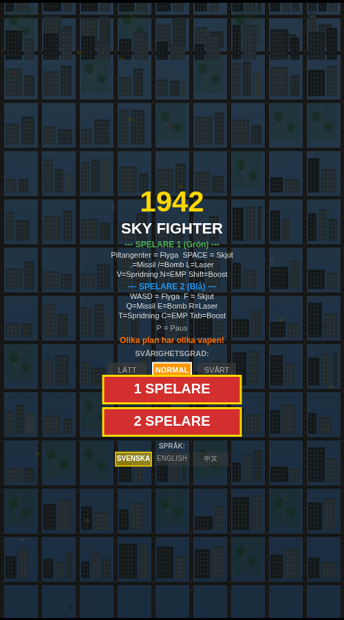
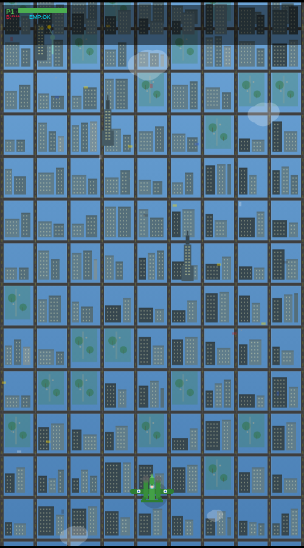

# 1942 - Sky Fighter

A retro-style top-down vertical scrolling shooter inspired by the classic 1942 arcade game. Built as a single HTML file using HTML5 Canvas and Web Audio API — no dependencies, no build step.

 

## Features

- **8 Levels** with unique city backgrounds (New York, Cairo, Moscow, Tokyo, London, Nairobi, Reykjavik, Berlin) and progressively harder bosses
- **4 Selectable Planes** — each with unique stats (HP, speed, fire rate, damage) and different attack loadouts:
  - **Lightning** — Balanced classic fighter (Missile, Bomb, EMP)
  - **Mustang** — Fast and offensive (Missile, Spread, Boost)
  - **Fortress** — Heavy firepower (Bomb, Spread, EMP)
  - **Spitfire** — Energy and speed (Laser, Boost, Missile)
- **Multiple Attack Types** — Machine gun, homing missiles, bombs, laser beam, spread shot, EMP pulse, speed boost
- **1 or 2 Player Mode** with full keyboard controls
- **Touch Controls** for mobile and iPad (virtual joystick + action buttons)
- **3 Difficulty Levels** — Easy, Normal, Hard
- **3 Languages** — Svenska, English, 中文
- **Procedural Audio** — Sound effects and unique background music per level using Web Audio API
- **Epic Boss Battles** with 5-second explosion sequences on defeat

## How to Play

Open `index.html` (or `pilot_game.html`) in any modern browser. That's it!

### Keyboard Controls

| Action | Player 1 | Player 2 |
|--------|----------|----------|
| Move | Arrow keys | WASD |
| Shoot | Space | F |
| Missile | . (period) | Q |
| Bomb | / (slash) | E |
| Laser | L | R |
| Spread | V | T |
| EMP | N | C |
| Boost | Shift | Tab |
| Pause | P or Escape | |

### Mobile / Touch

- **Left side** — Virtual joystick (drag to move)
- **Right side** — Fire button + special attack buttons (varies by plane)

## Play Online

Deploy to any static hosting:

```bash
# Using surge.sh
npm install -g surge
surge . your-game-name.surge.sh

# Or drag index.html to https://app.netlify.com/drop
```

## License

MIT
